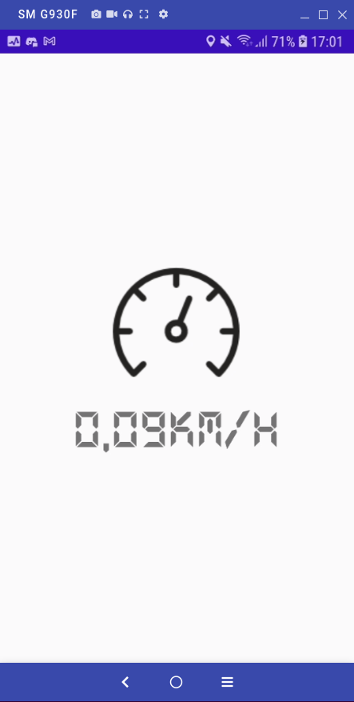
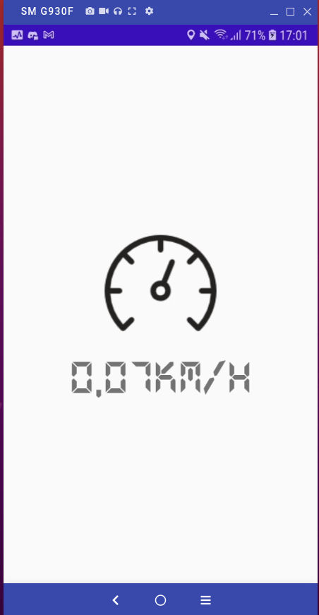

# Mobile-SOLID
App usado para funcionar como velocimetro

## Screenshots

## API
- [LocationManager](https://developer.android.com/reference/android/location/LocationManager)
- [Location](https://developer.android.com/training/location/retrieve-current)
